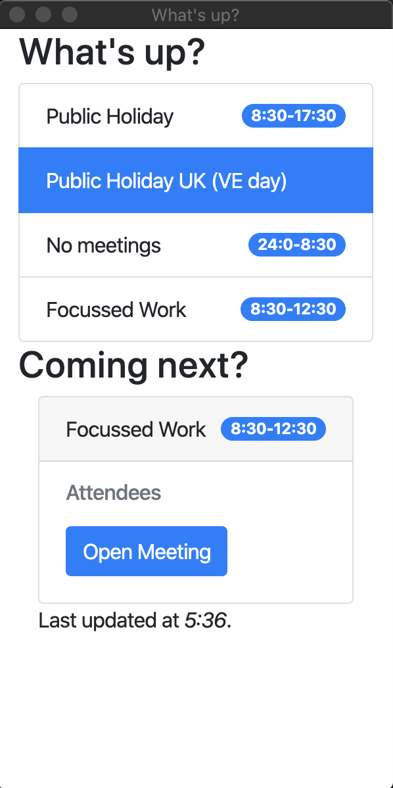

# Logic Calendar

Logic Calendar is a node application, packaged with Electron; utilising a logic application backend. The purpose is to show a lightweight calendar of upcoming events, so you can close Teams and Outlook for periods of focussed work.

Caveat. I'm not a node developer. Python and C# forever. So please critique and check the code before using.

## Example in use



## Installation

This application assumes that you have node installed, and access to either Logic Apps on Microsoft Azure, or Microsoft Power Automate.

1. Upload the API for Calendar View package to a logic app.

2. Create a .env file, and set the `CALENDAR_URL` variable to the URL of your new logic app.

3. You're ready to go.

## Usage

```bash
./runApp.sh
```

You may need to change permissions on the script with `chmod +x runApp.sh`.

## Future Development

- Desktop/Toast Notifications
- Windows Instructions
- Power Automate Instructions
- More Detail
- Automatic extraction of Teams, Zoom, WebEx, Skype, and other URLS
- More meeting information
- Date pagination
- Rejecting/declining meetings
- Customisable refresh times
- General refactoring

## Contributing

Pull requests are welcome. For major changes, please open an issue first to discuss what you would like to change, as I'm currently actively working on this.

## License

[MIT](https://choosealicense.com/licenses/mit/)

## Attribution

- Icon source: [Calendar icon](https://icons8.com/icons/set/calendar) icon by [Icons8](https://icons8.com)
